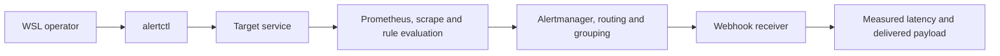

# alertmanager-drill

[](https://github.com/RedBeret/alertmanager-drill/actions/workflows/ci.yml)
[](LICENSE)
[](compose.yml)

Most alert rules have never fired outside the editor they were written in. They are
committed, reviewed, and trusted for years without anyone confirming that the rule
evaluates, that Alertmanager routes it to the right receiver, that the notification
arrives, or that it clears when the condition does.

alertmanager-drill proves those things for a declared set of rules. It drives a real
service into a real failing state, measures how long the notification actually took to
arrive, checks it against the receiver and labels the contract declares, remediates the
condition, and requires the resolved notification to arrive too.

Everything runs locally in WSL with Docker. No cloud account, paging vendor, or
production credentials are required.

## Current state

Stage 1 of 6 is complete: the contract, the isolated stack, and the operator commands.
The drill logic itself lands in the stages below.

- declared alerting contract in `drill/contract.yaml`
- isolated four-service stack on loopback-only ports
- Compose project label used as the safety boundary before any destructive action
- `alertctl` operator command with `doctor`, `up`, `down`, `status`, and `test`
- readiness polled against each service's own endpoint rather than container state
- 20 unit and contract tests, including checks that the contract cannot pass vacuously

## Architecture



The target service exposes a gauge and two control endpoints. The drill calls `/break` to
start the condition and `/fix` to clear it, so the alert fires from a real state change
observed in a real scrape rather than from a metric written directly into Prometheus.

## Requirements

- WSL2 with an Ubuntu distribution
- Python 3.11 or newer
- Docker with a reachable daemon
- Docker Compose v1 or v2

## Quick start

```bash
git clone https://github.com/RedBeret/alertmanager-drill.git
cd alertmanager-drill
./scripts/bootstrap.sh
./scripts/lab.sh doctor
./scripts/lab.sh up
```

`up` builds the two lab images, starts all four services, and then polls every service's
own endpoint until it answers. It reports which service failed to become ready rather
than a bare timeout.

## Commands

| Command | What it does |
| --- | --- |
| `doctor` | check Python, the Docker daemon, the Compose command, and that the contract parses |
| `up` | start the isolated stack and wait for every endpoint to answer |
| `status` | report container state and endpoint reachability |
| `validate` | check the Prometheus config, the rule files, and the Alertmanager config |
| `down` | remove only this project's containers, networks, and volumes |
| `test` | run the unit and contract tests |

Every command runs through `./scripts/lab.sh`, which is a thin wrapper around the
project-local `alertctl`. CI runs the same entrypoints, so it cannot drift from a
workstation.

## Static validation

```bash
./scripts/lab.sh validate
```

`validate` runs `promtool check config`, `promtool check rules` on every rule file, and
`amtool check-config`. It needs no running stack.

It then does the half that matters more. A validator that accepted anything would also
pass every check above, so `validate` keeps fixtures that must be rejected and fails if any
of them is accepted:

| Fixture | Why it must fail |
| --- | --- |
| `unparseable-expression.rules.yml` | the expression is not valid PromQL |
| `missing-expression.rules.yml` | labels, annotations, and a `for` duration but no `expr`, which is the shape a half-finished rule actually takes |
| `undefined-receiver.alertmanager.yml` | the route sends everything to a receiver that is not defined |

Repairing any fixture makes `validate` exit non-zero and name it, which is how the second
phase was checked rather than assumed.

## Rule unit tests

`validate` also runs `promtool test rules`, which drives synthetic series through the real
rule files and asserts exactly which alerts exist at a given second, with which labels and
annotations. Syntax checking only proves a rule parses. These prove it fires when it should
and, just as importantly, stays quiet when it should not:

- nothing fires while the target is healthy
- nothing fires while the condition is younger than the rule's `for` duration, so a single
  bad scrape does not page
- past the `for` duration the alert exists carrying every label the Alertmanager route
  matches on
- a target that recovers inside the `for` window never fires at all
- an unscrapeable target raises the warning alert, not the critical one, so a network blip
  does not page as a service fault

The assertions are tied to `for: 15s` in `drill.rules.yml`. Changing that duration to 60s
makes them fail, and so does changing the `team` label. Both were checked by making the
change and watching the suite go red.

`tests/test_rule_tests.py` guards the guards: it fails if a test file asserts nothing, if
no assertion expects an alert to fire, if none expects an alert to be absent, if a rule the
contract drills has no unit test, or if a unit test does not pin a label the contract
routes on.

Both tools ship inside the Prometheus and Alertmanager images the stack already pins, so
they are run from those images rather than installed separately. The validator is then the
same build as the runtime and the two cannot drift. The configs are mounted at the same
paths the running containers use, so promtool resolves the `rule_files` glob exactly the
way Prometheus will. `tests/test_tools.py` fails if those two mount paths ever diverge,
because that divergence is silent: validation would pass while the stack stayed wrong.

## What the contract declares

`drill/contract.yaml` declares, for each rule under test, the condition that makes it
fire, the maximum seconds to notification, the receiver it must arrive at, the labels and
annotation keys it must carry, and the maximum seconds to resolution.

Every check records the expected value, the observed value, and a pass field. A reading
the stack does not supply compares unequal and fails, so a missing observation is never an
implicit pass. A notification that arrives at the wrong receiver fails routing even though
the rule fired correctly.

## Isolation

Every container carries the Compose project label `alertdrill`, and `safety.py` refuses to
act on a container that does not. Every published port binds to `127.0.0.1` only:
Prometheus 19090, Alertmanager 19093, the receiver 19094, and the target 19095. Teardown
removes only `alertdrill` containers, networks, and volumes.

## Challenges and resolutions

**The receiver could not write its capture file.** The container runs as UID 10001 and the
named volume mounted at `/captures` was created root-owned, so the first write failed with
`Permission denied` and the service exited before serving anything. The directory is now
created in the image and given to the runtime user, because Docker copies ownership from
the image when it first populates a named volume.

**Compose v1 rejected the compose file.** The file used the top-level `name:` key from the
Compose specification, which v1 does not accept, and WSL boxes still commonly ship v1
1.29.2. The project name comes from `-p` in the command builder instead. The Compose
command is now detected rather than assumed, and `up --wait` is not used because v1 has no
such flag and it would report the container started rather than the service answering.

## Roadmap

| Stage | Delivers |
| --- | --- |
| 1 | contract, isolated stack, operator commands (done) |
| 2 | promtool rule validation and negative fixtures that must fail |
| 3 | live fire drill with measured latency |
| 4 | routing and resolution checks against the declared receiver |
| 5 | silence and inhibition handling |
| 6 | JSON, Markdown, and JUnit evidence, CI, and the clean-room teardown proof |

The full plan and the twelve done criteria are in
[docs/PROJECT_PLAN.md](docs/PROJECT_PLAN.md).
